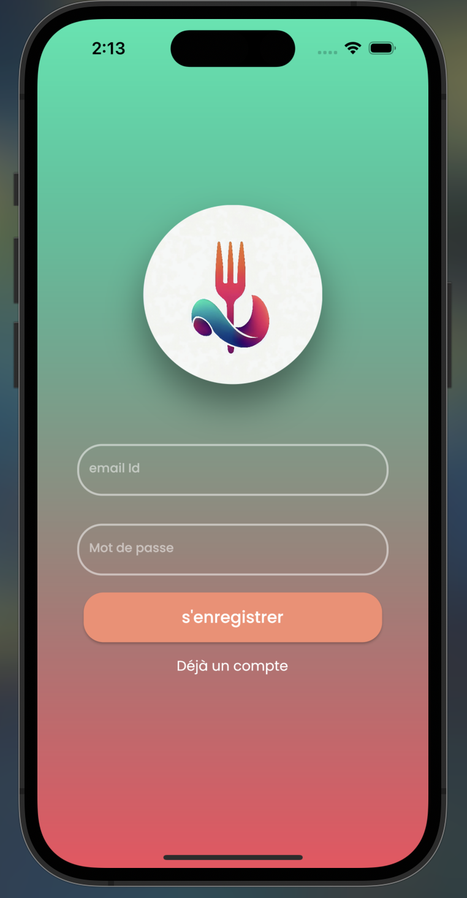
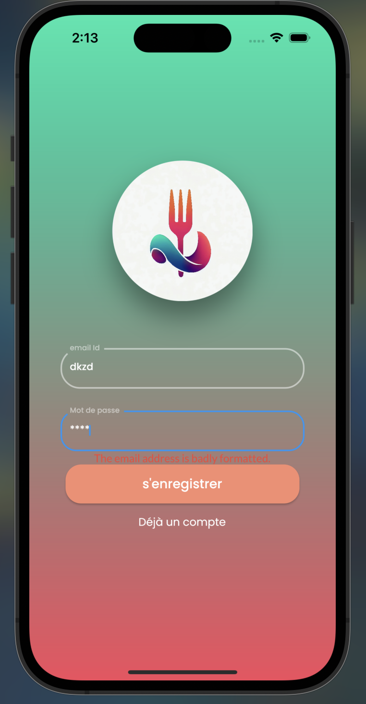
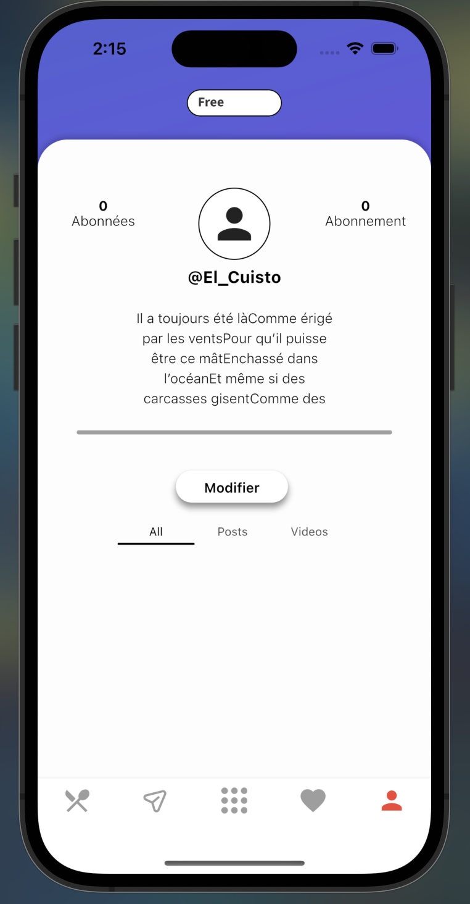
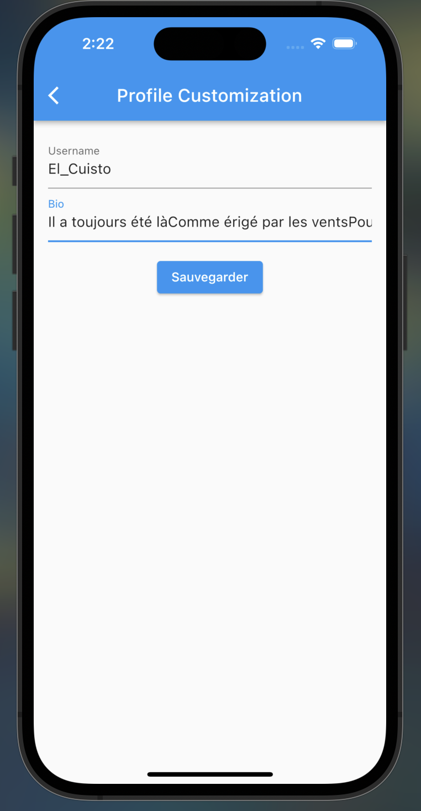
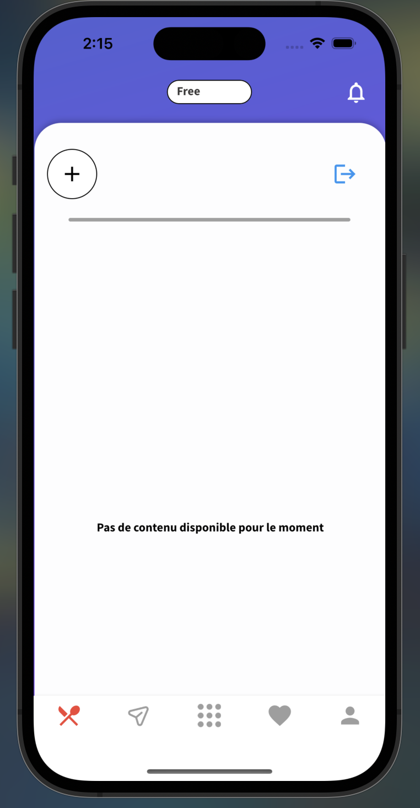

**Poseidon - Application de partage de recettes culinaires**

Bienvenue dans l'application Poseidon ! Poseidon est une application conviviale où les passionnés de cuisine peuvent partager leurs recettes, découvrir de nouvelles idées culinaires et se connecter avec une communauté engagée de chefs amateurs et professionnels.

## Fonctionnalités Disponibles pour le moment

- **Création de profil et réseau social** : Créez votre profil d'utilisateur via votre adresse mail et un mot de passe de plus de 6 caractères. Les images ci-dessous montrent les étapes de la création de profil.

 

> faite attention a mettre une adresse valide

- **Modification profile utilisateur** : Par defaut lors de la creation de votre compte c'est votre adresse mail qui fait offcie de pseudo, vous avez la possibilité de modifier votre pseudo et votre bio. Pour modifier appuyer sur "Modifier". Les images ci-dessous montrent les étapes de la modification de profil.

 

La barre de navigation permet de d'aller sur les différent onglets (Feed,Dm,explore,collections et profile). Pour le moment seul l'onglet profile et Acceuil/Feed est implementé.

## Installation et exécution

A noter que l'application étant en cours de devellopement, seul la compatibilité IOS est disponible pour le moment.
1. Assurez-vous d'avoir Flutter installé sur votre machine. Vous pouvez le télécharger à partir du site officiel de Flutter (https://flutter.dev).
2. Clonez ce dépôt
3. Naviguez vers le répertoire du projet avec `cd Poseidon`.
4. Exécutez `flutter pub get` pour récupérer les dépendances du projet.
5. Connectez votre appareil iOS à votre ordinateur ou utilisez un émulateur.
6. Exécutez l'application en utilisant la commande `flutter run`.

## Technologies utilisées

- Flutter : Poseidon est développé en utilisant le framework Flutter, qui permet la création d'applications multiplateformes avec une seule base de code. Flutter offre des performances élevées, une interface utilisateur réactive et une facilité de développement.
- Firebase : une solution de stockage et de gestion des données efficace et scalable.

## A venir 
- **Publication de Posts** : Un post est une publication contenant les ingrédients, les instructions, les informations nutritionnelles et des photos de la recettes.
- **Recherche de recettes** : Parcourez une vaste collection de recettes provenant d'une variété de comptes gratuit. Utilisez des filtres et des catégories pour trouver des recettes adaptées à vos préférences culinaires et à vos besoins diététiques.
- **Interactions sociales** : Commentez les recettes, partagez vos impressions et échangez des astuces culinaires avec d'autres utilisateurs. Suivez les profils des utilisateurs dont vous aimez les recettes et recevez des notifications sur leurs nouvelles publications.
- **Favoris et collections** : Enregistrez vos recettes préférées dans vos favoris et créez des collections personnalisées pour organiser vos recettes en fonction de vos besoins et de vos intérêts.
- **abonnement a des compte professionnels** : Permettre d'obtenir du contenu professionnel pour avoir des plats d'une qualité prenium, avec toute les astuces disponible par le profesionnel avec la possibilité d'échangé avec.

